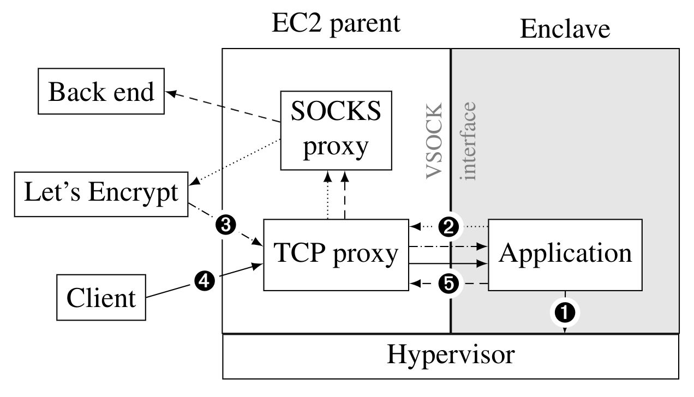

Architecture Documentation
==========================

This document explains the architecture of ia2.  In a nutshell, ia2 is a Go
application that runs inside a [Nitro
enclave](https://aws.amazon.com/ec2/nitro/nitro-enclaves/).  The rest of this
document explains the HTTP endpoints that ia2 exposes, how we turn the code into
an Enclave Image File (EIF), how ia2 bootstraps, how it does networking, and how
it does attestation.

HTTP endpoints
--------------

ia2 exposes two HTTPS endpoints:

* `GET /v2/confirmation/token/WALLET_ID`  
  Fastly mirrors requests for confirmation token refills to this endpoint.
  The code extracts client IP addresses from the HTTP header `Fastly-Client-IP`.

* `POST /attest`  
  Clients talk to this endpoint to request an attestation document from the
  enclave.  The form field is of the format `nonce=NONCE` where `NONCE`
  represents a random hex string consisting of 40 digits, e.g.
  `4f61495297d282005d770593f6c5e28c7143561d`.  The purpose of the nonce is to
  allow clients to prove to themselves that the enclave is "alive" and not
  returning a pre-computed attestation document.

Technically, there is a third endpoint, `GET /address`, but it's currently not
in use.  We may be using this endpoint in the future, to give clients the
ability to submit their own addresses.

Build process
-------------

To start an enclave, we need an Enclave Image File (EIF) of ia2.  Using Nitro's
[command line
interface](https://docs.aws.amazon.com/enclaves/latest/user/nitro-enclave-cli.html),
we can take a given Docker image and turn it into an EIF.  Crucially, we must
build ia2 reproducibly, meaning that two subsequent and independent builds must
result in a byte-by-byte identical image.  Standard Docker cannot guarantee
that.  We use Google's [kaniko](https://github.com/GoogleContainerTools/kaniko)
to accomplish that.  kaniko takes as input a Dockerfile and can reproducibly
turn it into a Docker image, i.e. if Alice builds ia2, she ends up with the
exact same image as Bob.

Running `make eif` builds a Docker image, turns it into an EIF, terminates any
already-running enclaves (if any), and finally starts the freshly-built EIF.

Bootstrapping
-------------

When ia2 first starts, it needs entropy to create an X.509 certificate and to
create a secret for IP address anonymization.  Like virtual machines, enclaves
generally don't have enough entropy after boot to initialize the system's
entropy pool.  AWS fixes this problem by having the hypervisor expose an API
that applications can use to fetch randomness.  In our case, we use that
randomness to seed the system's entropy pool.

Once the enclave can read from /dev/urandom, we generate a secret for IP address
anonymization and use Let's Encrypt to generate a CA-signed X.509 certificate.
Note that we cannot cache this certificate!  This means that every time we start
an enclave, it obtains a new X.509 certificate.  Let's Encrypt employs [rate
limits](https://letsencrypt.org/docs/rate-limits/) that we could hit if we were
to restart an enclave too often.  Let's keep this in mind.

Sending and receiving network packets
-------------------------------------

By design, enclaves have limited networking ability.  All network communication
must be routed over a VSOCK interface.  Note that a VSOCK interface uses a
different address family (AF\_VSOCK) than standard IP Networking (AF\_INET) and
not all applications support VSOCK.

To receive incoming connections, we use a [VSOCK
Go package](https://github.com/mdlayher/vsock) to create a custom listener that
listens for new incoming connections over our VSOCK interface.  We then pass
this listener to Go's standard HTTP server, and the rest works as expected.
The parent EC2 instance serves as a TCP proxy that forwards incoming connections
to the enclave.

Outgoing connections are a little bit more complicated.  The enclave can only
talk to the parent EC2 instance.  To get around this limitation, we set up a
SOCKS proxy on the parent EC2 instance and teach the enclave to use it.  We use
SOCKS because Go's HTTP code natively supports SOCKS (and other protocols) by
setting the `HTTP_PROXY` and `HTTPS_PROXY` environment variables to, say,
"socks5://127.0.0.1:1080".  However, when setting those variables, Go will
attempt to establish an AF\_INET-based rather than an AF\_VSOCK-based socket to
the SOCKS proxy.  We therefore need to add a proxy that translates between
AF\_INET and AF\_VSOCK.  The
[nitriding](https://github.com/brave/nitriding)
package takes care of that, and forwards SOCKS connections to the SOCKS proxy
running on the parent EC2 instance.

The diagram below illustrates how network packets are sent and received.

Attestation
-----------

When clients request an attestation document via the /attest endpoint, ia2
generates an attestation document by asking the Nitro hypervisor, which exposes
a /dev/nsm device.  We use the [nsm](https://github.com/hf/nsm/) Go library to
interact with the hypervisor.

When requesting an attestation document, one can provide three fields that the
hypervisor will include (and sign) in the resulting document:

1. A nonce.
2. User-provided data.
3. A public key.

The nonce is provided by the client when it contacts the /attest endpoint.  The
user-provided data is the SHA-256 digest over the enclave's X.509 certificate --
the same SHA-256 digest that you can see in your browser when inspecting a
site's certificate.  The digest's purpose is to tie the HTTPS connection to the
attestation document, which proves to the client that its HTTPS connection is
terminated by the enclave, and only the enclave.  We leave the public key empty.
